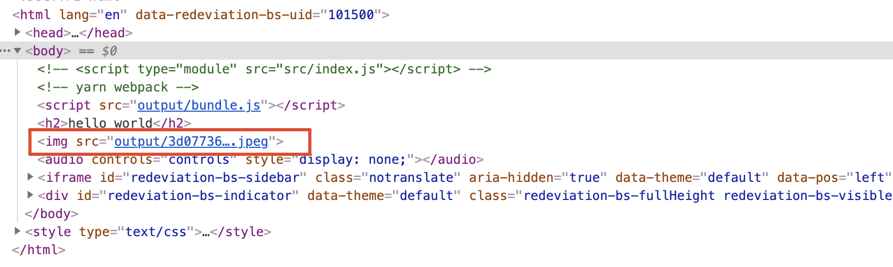
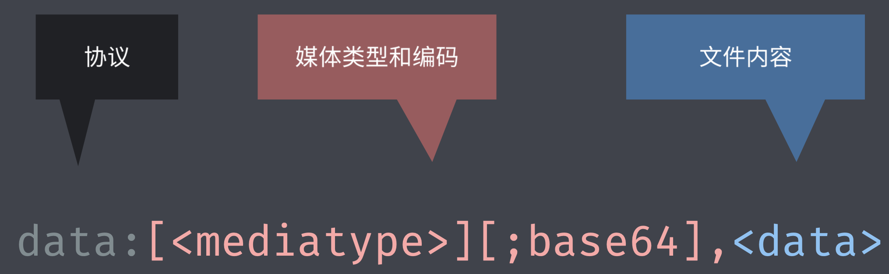
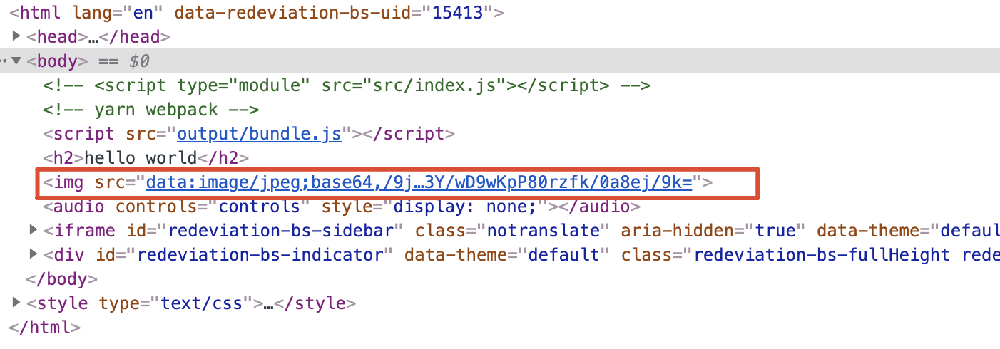
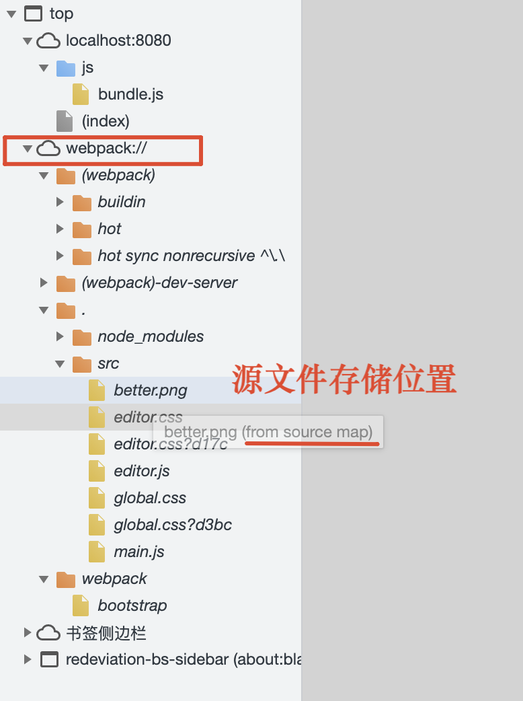
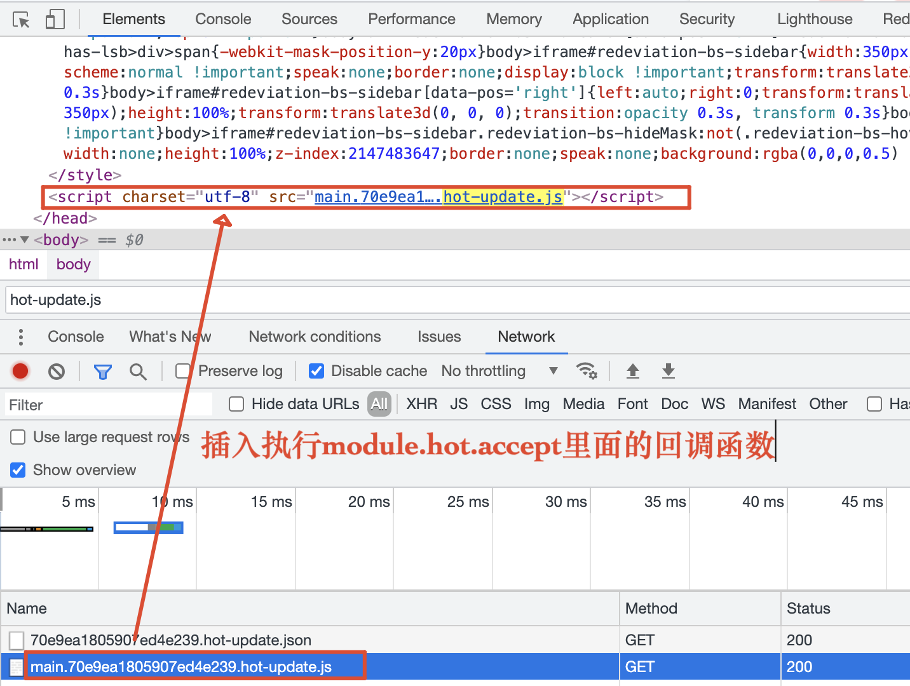

### 模块化

#### 模块化演变过程

- 文件划分方式（完全依靠约定）
  - 污染全局作用域
  - 命名冲突问题
  - 无法管理模块依赖关系
- 命名空间方式（每个模块只暴露一个全局对象，所有模块成员都挂载到这个对象中）
- IIFE(Immediately-Invoked Function Expression) 立即执行函数为模块化提供私有空间，通过传参确定模块的依赖关系

#### 模块化规范

模块化标准+模块加载器

- CommonJS 规范(以同步模式加载模块，启动过程中加载模块，执行过程中不需要再去加载，只需要使用模块，在 node 中不会有问题，在浏览器中使用会导致大量同步请求出现)
  - 一个文件就是一个模块
  - 每个模块都有单独的作用域
  - 通过 module.exports 导出成员
  - 通过 require 函数载入模块
- AMD(Asynchronous Module Definition)
  - 使用相对复杂
  - 模块 JS 文件请求频繁
- sea.js + CMD
- ES Modules
  - 自动采用严格模式，忽略'use strict'
  - 每个 ESM 模块都是单独的私有作用域
  - ESM 是通过 CORS 去请求外部 JS 模块的
  - ESM 的 script 标签会延迟执行脚本

#### ES Modules in Node.js - 与 CommonJS 交互

- ES Modules 中可以导入 CommonJS 模块
- CommonJS 中不能导入 ES Modules 模块
- CommonJS 始终只会导出一个默认成员
- import 不是解构导出对象

#### ES Modules 和 CommonJS 的区别

------

### webpack打包

#### 模块打包工具的由来

- ES Modules存在环境兼容问题 - 将新特性代码编译为浏览器可执行的代码
- 模块文件过多，网络请求频繁 - 将散落的模块文件打包到一起（Bundle.js）
- 所有的前端资源都需要模块化 - 将资源文件都当作模块使用以便统一模块化方案

#### 模块打包工具的概要

打包工具解决的是前端整体的模块化，并不单指JavaScript模块化

- 模块打包器（Module bundler）- 将散落的模块文件打包到一起
- 模块加载器（Loader）- 将有环境兼容问题的代码，在打包的过程中，通过模块加载器（Loader）来进行编译转换
- 代码拆分（Code Splitting）- 将代码按照需要打包，把项目运行过程中初次运行过程中必须的模块打包到一起，其他模块等应用过程中需要时再进行异步加载，避免bundle.js文件过大、文件过碎，实现增量加载、渐进加载
- 模块资源（Asset Module）- 支持在js中以模块化的方式载入任何类型的资源文件

#### 使用

```shell
yarn init -y
yarn add webpack webpack-cli --dev
yarn webpack
```

#### Loader

Loader是Webpack的核心特性

借助于Loader就可以加载任何类型的资源

在代码当中所有需要引用的资源都会被webpack找出，然后根据配置交给不同的loader处理，然后讲处理的结果整体打包到输出目录，从而实现整个项目的模块化

**为什么在js里面导入css等文件（为什么样式和行为不分离了）**

根据代码的需要动态导入资源，需要资源的不是应用，而是代码

js驱动整个前端应用

- 逻辑合理，js确实需要这些资源文件
- 确保上线资源不缺失，都是必要的

**分类**

- 编译转化类（把加载到的资源模块转换为js代码，如css-loader）
- 文件操作类（把加载到的资源模块拷贝到输出的目录，把文件访问路径导出，如file-loader）
- 代码检查类（对加载到的资源文件进行校验，目的是为了统一代码风格从而提高代码质量，通常不会修改生产环境的代码，如eslint-loader）

**css资源加载**

css文件加载（通过css-loader将文件打包到bundle.js中）

```shell
yarn add css-loader --dev
yarn add style-loader --dev
```

webpack.config.js

```js
// style-loader将css-loader转换过后的结果通过style标签的形式追加到页面上
module: {
  rules: [
    {
      test: /.css$/,
      use: ["style-loader", "css-loader"], //从后往前执行
    },
  ],
},
```

**file-loader**

图片、字体等没有办法通过js去表示

file-loader通过拷贝物理文件的形式处理文件资源

```shell
yarn add file-loader --dev
```



**data urls**

特殊的url协议，可以直接表示一个文件，传统的url需要服务器上面有一个对应的文件，然后通过请求得到该资源，而data url里面已经包含了文本内容，不会再发送请求



```
data:text/html;charset=UTF-8,<h1>html content</h1>
```

```
data:image/png;base64,iVBORw0KGgoAAAANSUhE...SuQmCC
```

**url loader**

```
yarn add file-loader --dev
```

借助url loader可以将文件转换为data url，适合体积比较小的资源，体积过大会导致打包的文件体积大从而影响运行速度



- 小文件使用url-loader生成data url，减少请求次数
- 大文件使用file-loader单独提取存放，提高加载速度

**html loader**

```
yarn add html-loader
```

**ES2015**

因为打包需要，所以才处理import、export，但并不代表可以编译es6的代码，webpack仅仅是对模块完成打包工作

- webpack只是打包工具
- 加载器可以用来编译转换代码

```
yarn add babel-loader @babel/core @babel/preset-env --dev
```

**webpack加载资源的方式**

- 遵循es modules标准的import声明
- 遵循commonjs标准的require函数
- 遵循amd标准的define函数和require函数
- loader加载的非javascript也会触发资源加载（样式代码中的@import指令和url函数、html代码中图片标签的src属性、a标签的href属性）

#### 工作原理

根据配置找到入口文件(entry),根据入口文件代码中import或者require等语句来解析推断所依赖的模块，然后分别解析每个资源模块对应的模块，从而生成了一颗依赖树，递归依赖树找到每个节点对应的资源文件，根据配置文件的rules属性找到模块多对应的加载器，加载器加载完对应的模块后，最后将加载的结果放到出口文件

------

### Loader工作原理

Loader负责资源文件从输入到输出的转换，对于同一个资源可以一次使用多个loader

------

### 插件

增强webpack自动化能力，loader专注实现资源模块加载，plugin解决其他自动化工作，例如：在打包之前清除dist目录、拷贝静态文件至输出目录、压缩输出代码，实现大多前端工程化工作

#### 常用的插件

**clean-webpack-clean**

```
npm i clean-webpack-plugin -D
```

**html-webpack-plugin**

- webpack自动生成使用bundle.js的HTML

```
npm i html-webpack-plugin -D
```

- 自定义模板html
- 同时输出多个页面文件

**copy-webpack-plugin**

开发阶段最好不要使用，打包过程中开销比较大，使用webpack-dev-server的contentBase一样可以访问额外的静态资源文件

#### 插件工作原理

相比Loader，Plugin拥有更宽的能力范围

通过钩子机制实现，在生命周期的钩子挂载函数实现扩展

一个函数或者是一个包含apply方法的对象

```js
class MyPlugin {
  apply(compiler) {
    console.log("MyPlugin 启动");
    compiler.hooks.emit.tap("MyPlugin", (compilation) => {
      // compilation => 可以理解为此次打包的上下文
      for (const name in compilation.assets) {
        // console.log(name)
        // console.log(compilation.assets[name].source())
        if (name.endsWith(".js")) {
          const contents = compilation.assets[name].source();
          const withoutComments = contents.replace(/\/\*\*+\*\//g, "");
          compilation.assets[name] = {
            source: () => withoutComments,
            size: () => withoutComments.length,
          };
        }
      }
    });
  }
}
```

### webpack开发体验增强

**开发体验问题**

编写源代码、webpack打包、运行应用、刷新浏览器

**理想的开发环境设想**

- 以http serve运行
- 自动编译、实时更新
- 提供source map支持，便于调试

**实现自动编译**

webpack-cli提供的watch工作模式

监听源文件变化，自动重新打包

```shell
webpack --watch
```

**实现自动刷新浏览器**

BrowserSync

```shell
browser-sync dist --files "**/*"
```

- 操作麻烦

- 降低效率，webpack不断将文件写入磁盘，browser-sync从磁盘中读取文件

#### webpack-dev-server

集成自动编译和自动刷新浏览器等功能，不将打包结果写入磁盘（没有出现dist目录），暂时将打包结果暂时存放在内存当中，减少了不必要的磁盘读写操作

```
npm i webpack-dev-server -D
```

**contentBase**

额外为开发服务指定查找资源目录

**proxy**

```js
devServer: {
  contentBase: './public',
  proxy: {
    '/api': {
      // http://localhost:8080/api/users -> https://api.github.com/api/users
      target: 'https://api.github.com',
      // http://localhost:8080/api/users -> https://api.github.com/users
      pathRewrite: {
        '^/api': ''
      },
      // 不能使用 localhost:8080 作为请求 GitHub 的主机名
      changeOrigin: true
    }
  }
},
```

#### Source Map(源代码地图)

运行代码与源代码之间完全不同，如果需要调试应用，错误信息无法定位，调试和报错都是基于运行代码。

source map用于映射源代码和转换之后的代码的关系，通过source map可逆向解析编译后的代码

在编译的代码文件最后加上，如在jquery-3.4.1.min.js文件的最后加上

```
//# sourceMappingURL=jquery-3.4.1.min.map
```

即可在开发工具中看到源代码



jquery-3.4.1.min.map文件中存储了

**webpack配置source map**

```
devtool: 'source-map'
```

webpack支持12种不同的方式，每种方式的效率和效果各不相同

`eval模式`

并没有生成source map，只能定位到出问题的是哪一个文件

```
console.log(123) //# sourceURL=./foo/bar.js  告诉执行引擎这段代码所属的文件路径
```

[打破砂锅问到底：详解Webpack中的sourcemap](https://segmentfault.com/a/1190000008315937)

  `cheap-eval-source-map`

使用eval函数执行函数代码，可以定位到出问题的文件及行信息，生成了source map，解析出的源代码经过了loader的加工

  `cheap-module-eval-source-map`

解析出的源代码没有经过loader的加工，和写的代码一致

  `eval-source-map`

使用eval函数执行函数代码，可以定位到出问题的文件及行、列信息，生成了source map

- eval - 是否使用eval执行模块代码
- cheap - source map是否包含列信息
- module - 是否能够得到loader处理之前的源代码
- inline - 把生成的map文件转换为DataUrl后以//# sourceMappingURL=DataUrl添加到转换后的文件中中
- hidden - 生成如query.min.map文件，但不会为打包后的代码添加引用注释。因此报错时控制台的输出错误效果会和没设置生成sourcemap的一样。
- nosource - 保护源代码，可以定位到问题出现的文件行列信息

**模式选择**

开发环境 cheap-module-eval-source-map

生产环境 nosources-source-map

#### HMR

**自动刷新的问题**

自动刷新导致的页面状态丢失

解决：页面不刷新的前提下，模块也可以及时更新

**概念**

Hot Module Replacement模块热替换（应用运行过程中实时替换某个模块，应用运行状态不受影响，热替换只将修改的模块实时替换至应用中，不需要刷新应用）

热拔插：在一个正在运行的机器上随时插拔设备，例如usb设备

**启用**

集成在webpack-dev-server

```
webpack-dev-server --hot
```

配置

```node
const webpack = require('webpack')
devServer: {
  hot: true
  // hotOnly: true // 只使用 HMR，不会 fallback 到 live reloading
},
plugins: [
  new webpack.HotModuleReplacementPlugin()
]
```

**疑问**

webpack中的HMR并不可以开箱即用，需要手动处理模块热替换逻辑

Q1:为什么样式文件的热更新可以开箱即用，脚本文件却不可以

style-loader自动处理了样式文件的热更新

脚本文件的更新是没有规律的，但是样式文件只需要替换style标签里面的样式

Q2:使用框架没有进行手动处理也可以实现热替换

框架下的开发，每种文件都是有规律的，通过脚手架创建的项目内部都集成了HMR方案

总结：需要手动处理JS模块热更新后的热替换

**HMR APIs**

```
module.hot.accept(模块, () => {})
```

修改文件之后会发送两个http请求，并js插入到html文件中



**注意事项**

1. 处理HMR的代码报错会导致自动刷新（设置hotOnly: true）
2. 没有启用HMR的情况下，HMR API报错（注释掉插件可复现）（判断module.hot是否存在）
3. 代码中多了一些与业务无关的代码

### 生产环境优化

开发体验的增强，导致打包的结果变得臃肿，比如source map、hmr会在打包结果中添加一些额外的代码，生产环境更加注重运行效率

#### 模式

为不同的环境创建不同的配置

**不同环境下的配置**

1. 配置文件根据环境不同导出不同配置

   ```
   webpack --env production
   ```

2. 一个环境对应一个配置文件

   ```
   const merge = require('webpack-merge') // 合并配置
   ```

   ```
   webpack --config webpack.prod.js
   ```

#### DefinePlugin

内置插件，为代码注入全局成员：process.env.NODE_ENV

```
const webpack = require('webpack')
module.exports = {
  plugins: [
    new webpack.DefinePlugin({
      // 值要求的是一个代码片段
      API_BASE_URL: JSON.stringify('https://api.example.com')
    })
  ]
}
```

#### Tree-Shaking

生活中的场景把枯枝败叶摇下来，在开发中指摇掉代码中未引用的部分（dead-code）

tree shaking不是指某个配置选项，是一组功能搭配使用后的优化效果，production模式下自动启用

**使用**

```
module.exports = {
  optimization: {
    // 模块只导出被使用的成员
    usedExports: true,
    // 尽可能合并每一个模块到一个函数中
    concatenateModules: true,
    // 压缩输出结果
    // minimize: true
  }
}
```

usedExports负责标记枯树叶

minimize负责摇掉枯树叶

concatenateModules：尽可能合并每一个模块到一个函数中既提升了运行效率，又减少了代码的体积（scope hoidting作用域提升）

**babel**

Tree Shaking前提是ES Modules

有webpack打包的代码必须使用ESM，为了转换代码中的ECMAScript新特性，使用babel-loader（最新版本不会自动将esm转换为cjs，不会导致tree shaking是失效）处理js文件，在此过程中有可能将ES Modules转换为CommonJS（比如使用了@babel/preset-env插件），导致tree shaking失效

#### 副作用-sideEffects

允许通过配置标识代码是否有副作用从而为tree shaking提供更大的压缩空间

副作用：模块执行时除了导出成员之外所做的事情

一般用于npm包标记是否有副作用

webpack.config.js：开启sideEffects功能

```
module.exports = {
  optimization: {
    sideEffects: true,
  }
}
```

package.json：标识代码没有副作用

```
{
	// "sideEffects": false,
  "sideEffects": [
    "./src/extend.js",
    "*.css"
  ]
}
```

#### 代码分割-code splitting

代码分割/代码分包

**问题**

所有代码最终都会被打包到一起，可能会导致bundle体积过大，每个模块在启动时并不一定是必要的，资源太大或过碎都不行

**解决**

分包，按需加载

- 多入口打包
- 动态导入

**多入口打包**

一个页面对应一个打包入口，适合多页面应用

不同入口中肯定会有相同的模块，公共模块会重复打包

```
optimization: {
  splitChunks: {
    // 自动提取所有公共模块到单独 bundle
    chunks: 'all'
  }
},
```

**动态导入**

需要用到某个模块时，再加载这个模块，动态导入的模块会被自动分包，通过import()实现

原理：通过创建一个script脚本将文件引入

**魔法注释**

Magic Comments默认通过动态导入产生的bundle文件，名称只是一个序号，如果需要给bundle命名可以使用魔法注释

```
import(/* webpackChunkName: 'components' */'./posts/posts').then(({ default: posts }) => {
  mainElement.appendChild(posts())
})
```

相同的chunkname会被打包到一起

**MiniCssExtractPlugin**

提取css到单个文件

```
npm i mini-css-extract-plugin -D
```

通过link的方式引入样式文件，因此不需要使用style-loader通过style标签引用样式文件

```
<link href="xxx.css" rel="stylesheet">
```

如果css超过150kb左右可以考虑提取出一个单独的文件，不然会导致请求增加

**OptimizeCssAssetsWebpackPlugin**

压缩输出的CSS文件

webpack内置的压缩插件只会压缩js文件，其他文件的压缩需要使用额外的插件

可以在插件里面应用，也可以在minimizer里面应用（一般在这里应用，注意加上js压缩的插件TerserWebpackPlugin，不然以前能够压缩的js会得不到压缩）

**hash**

部署前端项目一般会启用服务器的静态资源缓存，避免重复的请求，如果缓存时间设置过短那么缓存效果会不太明显，设置的时间太长没有办法及时更新资源到客户端。

生产模式下，文件名使用hash，全新的文件名代表全新的请求

- hash：项目级别，项目中任何一个地方发生改变，会影响所有文件名
- chunkhash：chunk级别，动态导入会形成多个chunk
- contenthash：文件级别，不同文件hash值不同（八位的contenthash最合适）


### 拓展

[webpack配置---实现某文件夹下的文件不打包](https://blog.csdn.net/hfhwfw161226/article/details/96287063)

static目录下的文件不可通过require或者import的方式引入文件，否则该文件就会参与打包。可以通过http请求静态资源的方式