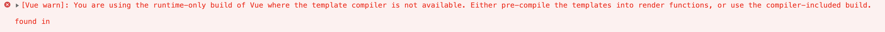

### Vue Router

#### 使用

1. 注册路由插件

   ```
   import Vue from 'vue'
   import VueRouter from 'vue-router'
   Vue.use(VueRouter)
   ```

2. 配置路由规则，创建 router 对象

   ```
   const router = new VueRouter({
     routes
   })
   ```

3. 注册 router 对象（this.$router、this.$route）

   ```
   new Vue({
     router,
     render: h => h(App)
   }).$mount('#app')
   ```

4. 创建路由组建的占位 

   ```
   <router-view/>
   ```

5. 创建链接

   ```
   <router-link to=""></router-link>
   ```

#### $router、$route

通过在 Vue 根实例的 `router` 配置传入 router 实例，下面这些属性成员会被注入到每个子组件。

- **this.$router**

  router 实例。

- **this.$route**

  路由规则，$router.currentRoute也可以获取，当前激活的[路由信息对象](https://router.vuejs.org/zh/api/#路由对象)。这个属性是只读的，里面的属性是 immutable (不可变) 的，不过可以 watch (监测变化) 它。

#### 动态路由

- 通过当前路由规则，获取数据，this.$route.params.id
- 开启 props，会把 URL 中的参数传递给组件，在组件中通过 props 来接收 URL 参数,props: ['id']

#### 嵌套路由

#### 编程式导航

this.$router.replace('')

this.$router.push('')

this.$router.push({ name: 'xxx', params: { xxx: xxx } })

replace和push的区别：replace不会记录本次历史

#### mode

- hash

  #后面的内容作为路径地址，url带有#、?携带路由参数，路径中携带与数据无关的符号

  基于锚点，以及onhashchange事件

  根据当前路由地址找到对应组件重新渲染

- history

  基于html5中的history api

  通过history.pushState() （ IE10以后才支持）方法改变地址栏

  监听popState事件

  根据当前路由地址找到对应组件重新渲染

  history.replaceState()

##### history

- history需要服务器的支持

- 单页应用中，服务端不存在http://xxx/xx这样的资源地址会报404（强制刷新页面的时候，切换路由不会报404）
- 在服务器端应该除了静态资源外都返回单页应用的index.html

nodejs服务器配置

nginx服务器配置：try_files

#### 实现原理

##### 前置知识

- 插件
- 混入
- Vue.observable()
- 插槽
- render函数
- 运行时和完整版的Vue

**问题**



Vue构建版本

- 运行时版：不支持template模板，需要打包的时候提前编译（render函数创建虚拟DOM，然后将虚拟DOM渲染到视图）
- 完整版：包含运行时和编译器（在运行时把模板转换为render函数），体积比运行时版大10k左右，程序运行的时候把模板转换为render函数

**解决**

- 使用包含运行时编译器的 Vue 构建版本

  vue.config.js

  ```
  module.exports = {
    runtimeCompiler: true,
  };
  ```


------

### 响应式原理


