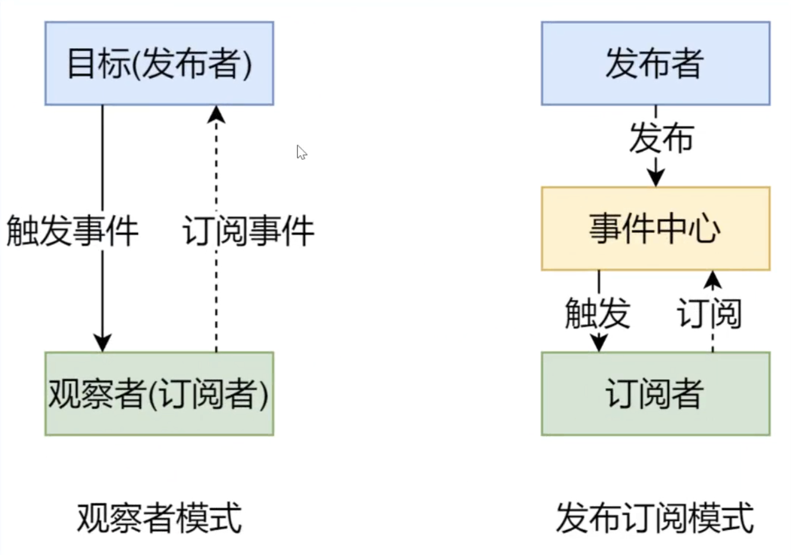
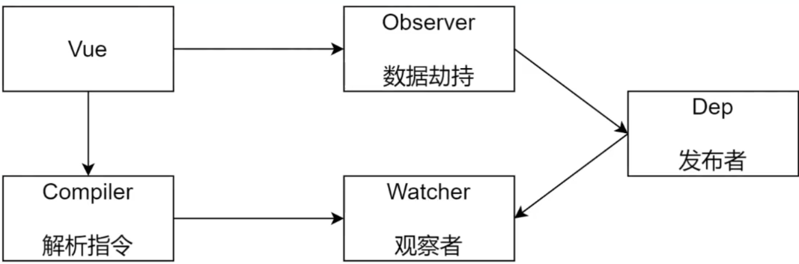
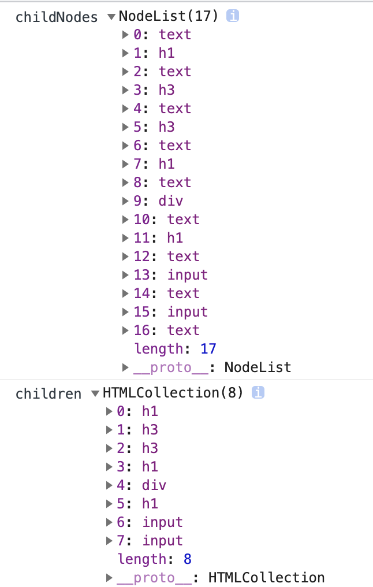

### Vue Router

#### 使用

1. 注册路由插件

   ```
   import Vue from 'vue'
   import VueRouter from 'vue-router'
   Vue.use(VueRouter)
   ```

2. 配置路由规则，创建 router 对象

   ```
   const router = new VueRouter({
     routes
   })
   ```

3. 注册 router 对象（this.$router、this.$route）

   ```
   new Vue({
     router,
     render: h => h(App)
   }).$mount('#app')
   ```

4. 创建路由组建的占位 

   ```
   <router-view/>
   ```

5. 创建链接

   ```
   <router-link to=""></router-link>
   ```

#### $router、$route

通过在 Vue 根实例的 `router` 配置传入 router 实例，下面这些属性成员会被注入到每个子组件。

- **this.$router**

  router 实例。

- **this.$route**

  路由规则，$router.currentRoute也可以获取，当前激活的[路由信息对象](https://router.vuejs.org/zh/api/#路由对象)。这个属性是只读的，里面的属性是 immutable (不可变) 的，不过可以 watch (监测变化) 它。

#### 动态路由

- 通过当前路由规则，获取数据，this.$route.params.id
- 开启 props，会把 URL 中的参数传递给组件，在组件中通过 props 来接收 URL 参数,props: ['id']

#### 嵌套路由

#### 编程式导航

this.$router.replace('')

this.$router.push('')

this.$router.push({ name: 'xxx', params: { xxx: xxx } })

replace和push的区别：replace不会记录本次历史

#### mode

- hash

  #后面的内容作为路径地址，url带有#、?携带路由参数，路径中携带与数据无关的符号

  基于锚点，以及onhashchange事件

  根据当前路由地址找到对应组件重新渲染

- history

  基于html5中的history api

  通过history.pushState() （ IE10以后才支持）方法改变地址栏

  监听popState事件

  根据当前路由地址找到对应组件重新渲染

  history.replaceState()

##### history

- history需要服务器的支持

- 单页应用中，服务端不存在http://xxx/xx这样的资源地址会报404（强制刷新页面的时候，切换路由不会报404）
- 在服务器端应该除了静态资源外都返回单页应用的index.html

nodejs服务器配置

nginx服务器配置：try_files

#### 实现原理

##### 前置知识

- 插件
- 混入
- Vue.observable()
- 插槽
- render函数
- 运行时和完整版的Vue

**问题**


Vue构建版本

- 运行时版：不支持template模板，需要打包的时候提前编译（render函数创建虚拟DOM，然后将虚拟DOM渲染到视图）
- 完整版：包含运行时和编译器（在运行时把模板转换为render函数），体积比运行时版大10k左右，程序运行的时候把模板转换为render函数

**解决**

- 使用包含运行时编译器的 Vue 构建版本

  vue.config.js

  ```
  module.exports = {
    runtimeCompiler: true,
  };
  ```


------

### 响应式原理

#### 数据驱动

- 数据响应式、双向绑定、数据驱动
- 数据响应式
  - 数据模型仅仅是普通的javascript对象，当我们修改数据时，视图会进行更新，避免了繁琐的DOM操作，提高开发效率
- 双向绑定（针对的是可以和用户交互的表单元素）
  - 数据改变，视图改变；视图改变，数据也随之改变
  - 可以使用v-model在表单元素上创建双向数据绑定
- 数据驱动是Vue最独特的特性之一（开发过程）
  - 开发过程中仅需要关注数据本身，不需要关心数据是如何渲染到视图

#### 响应式的核心原理

vue2.x

- [深入响应式原理](https://cn.vuejs.org/v2/guide/reactivity.html)
- [Object.defineProperty()](https://developer.mozilla.org/en-US/docs/Web/JavaScript/Reference/Global_Objects/Object/defineProperty)
- 浏览器兼容IE8以上（不兼容IE8）

Vue3.x

- [Proxy](https://developer.mozilla.org/en-US/docs/Web/JavaScript/Reference/Global_Objects/Proxy)
- 直接监听对象，而非属性
- ES6中新增，IE不支持，性能由浏览器优化

proxy的优点

- 使用proxy代码会比较简洁，不需要遍历所有属性

- 浏览器对proxy进行了性能优化

#### 发布订阅和观察者模式

##### 发布/订阅模式

- 发布/订阅模式

  - 订阅者

  - 发布者

  - 信号中心

  存在一个信号中心，某个任务执行完成，就向信号中心发布一个信号，其他任务可以向信号中心订阅这个信号，从而知道什么时候自己可以开始执行，这就叫发布/订阅模式

- [vue的自定义事件](https://cn.vuejs.org/v2/guide/components-custom-events.html#ad)

##### 观察者模式

- 观察者(订阅者)--watcher
  - update():当事件发生时，具体要做的事情
- 目标(发布者)--Dep
  - subs数组：存储所有的观察者
  - addSub()：添加观察者
  - notify()：当事件发生，调用所有观察者的update()方法
- 没有事件中心

##### 区别

- **观察者模式**是由具体目标调度，比如当事件触发，Dep 就会去调用观察者的方法，所以观察者模式的订阅者与发布者之间是存在依赖的。 
- **发布/订阅模式**由统一调度中心调用，因此发布者和订阅者不需要知道对方的存在。




#### 模拟Vue响应式原理

- 整体结构

  

- Vue：把 data 中的成员注入到 Vue 实例，并且把 data 中的成员转成 getter/setter 
- Observer：能够对数据对象的所有属性进行监听，如有变动可拿到最新值并通知 Dep 
- Compiler：解析每个元素中的指令/插值表达式，并替换成相应的数据 
- Dep：添加观察者(watcher)，当数据变化通知所有观察者 
- Watcher：数据变化更新视图

##### Vue

- 负责接收初始化的参数(选项)
- 负责把 data 中的属性注入到 Vue 实例，转换成 getter/setter 
- 负责调用 observer 监听 data 中所有属性的变化
- 负责调用 compiler 解析指令/插值表达式

##### Observer

- 负责把 data 选项中的属性转换成响应式数据
- data 中的某个属性也是对象，把该属性转换成响应式数据 
- 数据变化发送通知

##### Compiler

- 负责编译模板，解析指令/插值表达式 
- 负责页面的首次渲染 
- 当数据变化后重新渲染视图

### 虚拟DOM

#### Virtual DOM

- Virtual DOM(虚拟 DOM)，是由普通的 JS 对象来描述 DOM 对象，因为不是真实的 DOM 对象， 所以叫 Virtual DOM 
- 真实 DOM 成员

#### Why Virtual DOM

- 手动操作 DOM 比较麻烦，还需要考虑浏览器兼容性问题，虽然有 jQuery 等库简化 DOM 操作， 但是随着项目的复杂 DOM 操作复杂提升 
- 为了简化 DOM 的复杂操作于是出现了各种 MVVM 框架，MVVM 框架解决了视图和状态的同步问 题 为了简化视图的操作我们可以使用模板引擎，但是模板引擎没有解决跟踪状态变化的问题，于是 Virtual DOM 出现了 
- Virtual DOM 的好处是当状态改变时不需要立即更新 DOM，只需要创建一个虚拟树来描述 DOM， Virtual DOM 内部将弄清楚如何有效(diff)的更新 DOM 
- 参考 github 上 [virtual-dom](https://github.com/Matt-Esch/virtual-dom) 的描述 
  - 虚拟 DOM 可以维护程序的状态，跟踪上一次的状态 
  - 通过比较前后两次状态的差异更新真实 DOM


### 扩展

#### dom操作

**children和childnodes的区别**

childnodes可以遍历文本节点和元素节点

children只可以遍历元素节点



**nodeType**

https://developer.mozilla.org/zh-CN/docs/Web/API/Node/nodeType

**字符串方法**

startsWith

**闭包**


**正则表达式**

RegExp.prototype


