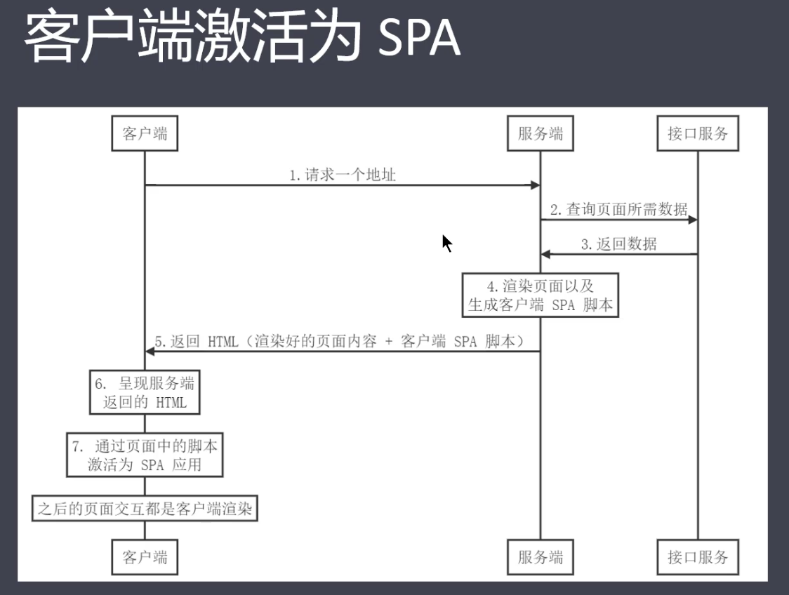
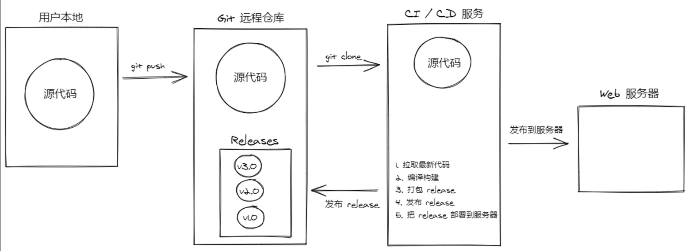

### SPA应用

**优点**

用户体验好

开发效率高

渲染性能好

可维护性好

**缺点**

首屏渲染时间长

不利于SEO（当搜索引擎爬取网站的html文件的时候，单页面html是没有内容的）

------

### 服务器端渲染

#### 传统的服务器端渲染

参考demo(/FE-STUDY/BIG-FRONT-END/PART03Vue.js 框架源码与进阶/03Vuex数据流管理以及Vue.js服务器端渲染(SSR)/02服务端渲染基础/服务器端渲染)


前后端代码耦合在一起，不利于开发和维护

前端没有足够发挥空间

服务器端压力大

用户体验一般

#### 客户端渲染（CSR）


**为什么客户端渲染慢**

至少要经过三个http请求周期

第一次拿html

第二次取js

第三次请求数据

**为什么不利于SEO**(搜索引擎得知道网页里面的内容)

查看demo(/FE-STUDY/BIG-FRONT-END/PART03Vue.js 框架源码与进阶/03Vuex数据流管理以及Vue.js服务器端渲染(SSR)/02服务端渲染基础/SEO)

因为客户端渲染只获取index.html的内容

#### 服务器端渲染



**同构应用**

同构渲染 = 后端渲染 + 前端渲染

通过服务器端首屏直出，解决SPA应用首屏渲染慢以及不利于SEO问题

通过客户端渲染接管页面内容交互得到更好的用户体验

这种方式通常称之为现代化的服务器端渲染，也叫同构渲染

这种方式构建的应用称之为服务器端渲染应用或者是同构应用

- 基于vue、react等框架，客户端渲染和服务器端渲染的结合
  - 在服务器端执行一次，用于实现服务器端渲染（首屏直出）
  - 在客户端再执行一次，用于接管页面交互
- 核心解决SEO和首屏渲染慢的问题
- 拥有传统服务端渲染的优点，也有客户端渲染的优点

**同构渲染应用的问题**

- 开发条件所限

  - 浏览器特定的代码只能在某些生命周期钩子函数中使用
  - 一些外部扩展库可能需要特殊处理才能在服务端渲染应用中运行
  - 不能在服务端渲染期间操作DOM
  - 某些代码操作需要区分运行环境

- 涉及构建设置和部署的更多要求

  |      | 客户端渲染                | 同构渲染                 |
  | ---- | ------------------------- | ------------------------ |
  | 构建 | 仅构建客户端应用即可      | 需要构建两个端           |
  | 部署 | 可以部署在任意Web服务器中 | 只能部署在Node.js Server |

- 更多的服务器端负载
  - 在node中渲染完整的应用程序，相比仅仅提供静态文件的服务器需要大量占用CPU资源
  - 如果应用在高流量环境下使用，需要准备相应的服务器负载
  - 需要更多的服务器端渲染优化工作处理
- 使用建议
  - 首屏渲染速度是否真的重要
  - 是否真的需要SEO

#### 什么是渲染

把数据+模板拼接到一起

------

### Nuxt.js

一个基于Vue.js生态的第三方开源服务器端渲染应用框架

可以帮助我们轻松使用Vue.js技术栈构建同构应用

#### 使用方式

- 初始项目

- 已有的Node.js服务端项目

  直接把Nuxt当作一个中间件集成到Node Web Server中

- 现有的Vue.js项目

  - 非常熟悉Nuxt.js
  - 至少百分之10的代码改动

#### 路由导航

- a标签：会刷新整个页面，不要使用
- nuxt-link组件
- router-link
- 编程式导航router.push

#### 动态路由

_xx.vue

访问/xx,可以通过route.params.xx获取参数值

#### 嵌套路由

nuxt-child

#### 视图-模板

#### 异步数据

**基本用法**

- 会将asyncData返回的数据融合组件data的方法返回数据一并给组件
- 调用时机：服务端渲染期间和客户端路由更新之前

**注意事项**

- 只能在页面组件(pages目录下)中使用
- 没有this,因为它是在组件初始化之前被调用的

#### 视图-布局

------

### Nuxt项目实战

##### 导入样式资源

CDN

https://www.jsdelivr.com

##### 客户端服务器端共享登录状态

[跨域身份验证 (JWT)](https://www.nuxtjs.cn/examples/auth-external-jwt)

##### 中间件

允许定义一个自定义函数运行在一个页面或一组页面渲染之前，有点类似于路由拦截器（保护需要校验登录状态的页面）

##### watchQuery

监听查询参数的改变（可以出发asyncData等函数，路由查询参数变化正常情况下不会触发这些函数）

------

### Nuxt项目部署

```shell
npm run build
npm run start
```

打包后的产物在.nuxt文件夹

#### 最简单的部署方式

- 配置host+port

- 压缩发布包

  - .nuxt：nuxt打包资源生成的文件
  - static ：静态资源，不会被打包
  - next.config.js：给nuxt服务使用
  - package-lock.json、package.json：在服务端安装依赖时需要使用

- 把发布包传到服务端

- 解压

- 安装依赖

  ```shell
  npm i
  ```

- 启动服务

  ```shell
  npm run start
  ```

#### 使用PM2启动Node服务

上面那种方式npm run start占用着命令行，如果退出命令行，服务就不能再继续被访问到了，因此需要在后台运行应用，需要借助pm2启动服务

pm2的作用：管理nodejs进程的应用，可以把nodejs应用运行在后台，保持运行状态

github地址：https://github.com/Unitech/pm2

官方文档：https://pm2.io/

补充：[PM2教程](https://www.bookstack.cn/books/pm2-runtime)

安装（服务器端）：

```shell
npm i -g pm2
```

启动（服务器端）：

```shell
pm2 start npm --start
```

关闭（服务器端）：

```shell
pm2 stop id
```

pm2常用命令：

| 命令        | 说明         |
| ----------- | ------------ |
| pm2 list    | 查看应用列表 |
| pm2 start   | 启动应用     |
| pm2 stop    | 停止应用     |
| pm2 reload  | 重载应用     |
| pm2 restart | 重启应用     |
| pm2 delete  | 删除应用     |

#### 自动化部署

##### 简介



##### CI/CD服务

- Jenkins
- gitlab CI
- github actions
- travis CI
- circle CI

**环境准备**

- Linux服务器
- 把代码提交到github远程仓库

**配置github access token**

生成:https://github.com/settings/tokens

配置到项目的secrets中：https://github.com/axiaoha/FE-STUDY/settings/secrets/actions

**配置github actions执行脚本**

- 在项目根目录创建.github/workflows目录

- 下载main.yml到workflows目录中(https://gist.github.com/lipengzhou/b92f80142afa37aea397da47366bd872)

- 修改配置

- 配置PM2配置文件(pm2.config.json)

  ```json
  {
    "apps": [
      {
        "name": "nuxtjs",
        "script": "npm",
        "args": "start"
      }
    ]
  }
  ```

- 提交更新

- 查看自动部署状态

- 访问网站

- 提交更新

[YAML 语言教程](http://www.ruanyifeng.com/blog/2016/07/yaml.html)


