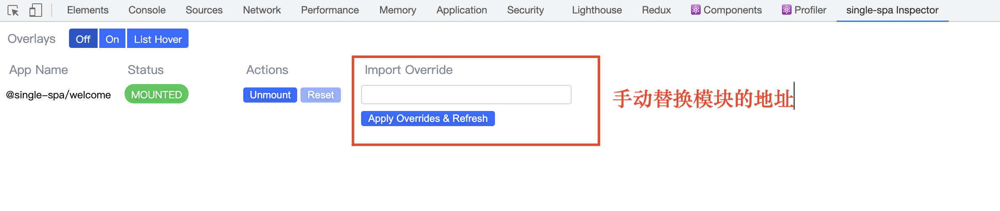

### 微前端概述

#### 什么是微前端

#### 微前端的价值

- 增量迁移

  在保留原有项目的同时，可以完全使用新的框架开发新的需求，然后再使用微前端架构将旧的项目和新的项目进行整合。

- 独立发布

  将不同的功能模块拆分成独立的应用，此时功能模块就可以单独构建单独发布，构建时间会变快，应用发布后不需要更改其他内容应用就会自动更新，意味着可以进行频繁的构建发布操作

- 允许单个团队做出技术决策

  微前端框架与框架无关，当一个应用由多个团队进行开发时，每个团队都可以使用自己擅长的技术栈进行开发，允许适当的让团队决策使用那种技术

**使用场景**

1. 拆分巨型应用，使应用变得更加可维护
2. 兼容历史应用，实现增量开发

#### 如何实现微前端

1. 多个微应用如何进行组合

   在微前端架构中，除了存在多个微应用之外，还存在一个容器应用，每个微应用都需要被注册到容器应用中。微前端中的每个应用在浏览器中都是一个独立的JavaScript模块，通过模块化的方式被容器应用启动和运行。使用模块化的方式运行应用可以防止不同的微应用在同时运行时发生冲突

2. 在微应用中如何实现路由

   在微前端架构中，当路由发生变化时，容器应用首先会拦截路由的变化，根据路由匹配到微前端应用，当匹配到微应用之后，在启动微应用路由，匹配具体的页面组件

3. 微应用与微应用之间如何实现状态共享

   在微应用中可以通过发布订阅模式实现状态共享，比如RxJS

4. 微应用与微应用之间如何实现框架和库的共享

   通过import-map（可以引用网络模块）和webpack的externals属性

### System.js模块化解决方案

在微前端架构中，微应用被打包为模块，但浏览器不支持模块化，需要使用systemjs实现浏览器中的模块化。system.js是一个用于实现模块化的javascript库，有属于自己的模块化规范。在开发阶段我们可以使用ES模块规范，然后使用webpack将其转换为systemjs支持的模块。

```shell
npm install webpack@5.17.0 webpack-cli@4.5.0 webpack-dev-server@3.11.2 html-webpack-plugin@4.5.1 @babel/core@7.12.10 @babel/cli@7.12.10 @babel/preset-env@7.12.11 @babel/preset-react@7.12.10 babel-loader@8.2.2
```

### single-spa

#### 概述

single-spa是一个实现微前端架构的框架

在single-spa框架中有三种类型的微前端应用(单独开发、构建、发布)：

1. single-spa- application(和路由相关联)/parcel(与路由无关，跨应用共享UI组件)：微前端架构中的微应用，可以使用vue、react、angular等框架
2. single-spa root config：创建微前端容器应用
3. utility modules：公共模块应用，非渲染组件，用于跨应用共享javascript逻辑的微应用

#### 创建容器应用

1. 安装single-spa脚手架工具：`npm install create-single-spa@2.0.3 -g`

2.  创建微前端应用目录：`mkdir workspace && cd "$_"`

3. 创建微前端容器：`create-single-spa`

   1. 应用文件夹填写container

   2. 应用选择single-spa root config

   3. 组织名称填写kong：

      组织名称可以理解为团队名称，微前端架构允许许多团队共同开发应用，组织名称可以标识应用由哪个团队开发。

      应用名称的命名规则为`@组织名称/应用名称`，比如：`@study/todos`

   4. 应用启动：`npm start`

   5. 访问应用：`localhost:9000`

   

4. 安装调试工具：single-spa inspector

   

#### 创建不基于框架的微应用

1. 应用初始化：`mkdir micro-spa-one && cd "$_"`

   ```shell
   npm i @babel/core single-spa webpack webpack-cli webpack-config-single-spa webpack-dev-server webpack-merge
   ```

2. 配置webpack（基于webpack-config-single-spa编写配置文件）

3. 在package.json文件中添加应用启动命令

4. 在应用入口文件中导出微前端应用所需的生命周期函数，生命周期函数必须返回promise

5. 在微前端容器应用中注册微前端应用

#### 创建基于React的微应用

1. 创建应用：`create-single-spa`
2. 提取react、react-dom和react-router-dom
3. 修改启动命令和启动应用
4. React应用配置路由

#### 创建基于Vue的微应用

1. 创建应用：`create-single-spa`
2. 提取vue和vue-router
3. 修改启动命令和启动应用
4. vue应用配置路由

#### 创建Parcel应用

parcel用来创建公共UI，涉及到框架共享UI时需要使用parcel

parcel的定义可以使用任何single-spa支持的框架，它也是单独的应用，需要单独启动，但是不关联路由

parcel应用的模块访问地址也需要被添加到import-map中，其他微应用通过system.import方法进行引用

1. 使用react创建parcel应用`create-single-spa`

2. 在webpack配置文件中去除react-router-dom

3. 指定端口启动应用

4. 在`容器`的模板文件index.ejs中指定应用模块地址

5. 在`react应用`中使用

   ```vue
   import Parcel from "single-spa-react/parcel";
   
   <Parcel config={System.import("@common/micro-parcel")}></Parcel>
   ```

6. 在`vue应用`中使用

   ```vue
   <Parcel :config="parcelConfig" :mountRootParcel="mountRootParcel"></Parcel>
   
   <script>
   import Parcel from "single-spa-react/parcel";
   import {mountRootParcel} from "single-spa"
   
   export default {
     name: "App",
     components: {
       Parcel
     },
     data(){
       return {
         parcelConfig:window.System.import("@common/micro-parcel")
         mountRootParcel
       }
     }
   };
   </script>
   ```

#### 创建utility modules

用于放置跨应用共享的javascript逻辑，是独立的应用，需要单独构建单独启动

1. 创建应用：`create-single-spa`

2. 修改端口，启动应用

3. 应用中导出方法

4. 在模板文件中声明应用模块访问地址

5. 在`react应用`中使用

   ```react
   import React, { useState, useEffect } from "react";
   
   function useUtilsModule() {
     const [utilsModule, setUtilsModule] = useState();
     useEffect(() => {
       System.import("@common/micro-utils").then(setUtilsModule);
     }, []);
     return utilsModule;
   }
   export default function Home(props) {
     const utilsModule = useUtilsModule();
     if (utilsModule) {
       utilsModule.sayHello("@gun/micro-react-spa");
     }
     return <div>Home</div>;
   }
   ```

6. 在`vue应用`中使用

   ```vue
   <button @click="handleClick">button</button>
   
   methods: {
     async handleClick() {
       const utilsModule = await window.System.import("@common/micro-utils");
       utilsModule.sayHello("@gang/micro-vue-spa");
     },
   },
   ```

#### 实现跨窗口通信

跨应用通信可以使用Rxjs，无关框架，可以在任何框架中使用

1. 在index.ejs文件中添加rxjs的import-map
2. 在utility modules中导出一个ReplaySubject，可以广播历史消息，就算应用是动态加载进来的，也可以接收到数据
3. 在react应用中订阅
4. 在vue应用中订阅

#### Layout Engine

允许使用组件的方式声明顶层路由（将访问地址和访问的应用对应起来），并且提供了更加便捷的路由API用来注册应用

1. 下载布局引擎`npm install single-spa-layout@1.3.1`

2. 构建路由

   ```html
   <template id="single-spa-layout">
     <single-spa-router>
       <application name="@common/micro-parcel"></application>
       <route default>
         <application name="@single-spa/welcome"></application>
       </route>
       <route path="micro-spa-one">
         <application name="@aha/micro-spa-one"></application>
       </route>
       <route path="micro-react-spa">
         <application name="@gun/micro-react-spa"></application>
       </route>
       <route path="micro-vue-spa">
         <application name="@gang/micro-vue-spa"></application>
       </route>
     </single-spa-router>
   </template>
   ```

   ```html
   <script type="systemjs-importmap">
     {
       "imports": {
         "@single-spa/welcome": "https://unpkg.com/single-spa-welcome/dist/single-spa-welcome.js"
       }
     }
   </script>
   ```

3. 获取路由信息&&注册应用

   ```js
   import { registerApplication, start } from "single-spa";
   import { constructApplications, constructRoutes } from "single-spa-layout";
   
   // 获取路由配置对象
   const routes = constructRoutes(document.getElementById("single-spa-layout"));
   // 获取路由信息数组
   const applications = constructApplications({
     routes,
     loadApp({ name }) {
       return System.import(name);
     },
   });
   // 便利路由信息注册应用
   applications.forEach(registerApplication);
   start({
     // 是否允许通过history.pushState()和history.replaceState()更改触发single-spa路由
     urlRerouteOnly: true,
   });
   ```

### Module Federation

#### 模块联邦概述

Module Federation即为模块联邦，是webpack5中新增的一项功能，可以实现跨应用共享模块


#### 快速上手

##### 需求

通过模块联邦在容器应用中加载微应用

##### 应用结构

```
products
	|—— package-lock.json
	|—— package.json
	|—— public
			|—— index.html
	|—— src
			|—— index.js
	|—— webpack.config.js
```

##### 应用初始化

1. 在入口javascript文件中加入产品列表
2. 在入口html文件中加入盒子
3. webpack配置

##### Module Federation

##### 文件打包加载分析

#### 共享模块

##### 实现模块共享

##### 共享模块版本冲突解决

##### 开放子应用挂载接口

### 基于模块联邦的微前端实现方案