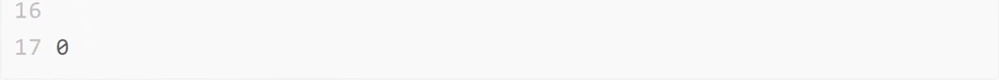

### 什么是web性能

简单来说就是你的网站够不够快

- 打开速度
- 动画效果
- 表单提交
- 列表滚动
- 页面切换
- .........

[MDN上的web性能定义](https://developer.mozilla.org/zh-CN/docs/Web/Performance)：Web 性能是客观的衡量标准，是用户对加载时间和运行时的直观体验。

- 减少整体加载时间：减少文件体积、减少http请求、使用预加载
- 使网站尽快可用：仅加载首屏内容，其他内容根据需要进行懒加载
- 平滑和交互性：使用CSS代替JS动画、减少UI重绘
- 感知表现：页面可能不能做得更快，但可以让用户感觉更快。耗时操作要给用户反馈，比如加载动画、进度条、骨架屏等提示信息
- 性能测定：性能指标、性能测试、性能监控持续优化

### 为什么要关注web性能

- 用户留存
- 网站的转化率
- 体验与传播
- 搜索排名
- 客户投诉
- ...........

### 如何进行web性能优化

- 了解性能指标 - 多久才算快
- 使用专业的工具可量化的评估出网站或应用的性能表现
- 立足于网站页面响应的生命周期，分析出造成较差性能表现的原因
- 进行技术改造、可行性分析等具体的优化实施
- 迭代优化

#### 性能指标

- RAIL性能模型
- 基于用户体验的核心指标
- 新一代性能指标：Web Vitals

#### 性能测量

- 浏览器DevTools调试工具
  - 网络监控分析
  - 性能监控分析
  - ..........
- 灯塔（LightHouse）
  - 网站整体质量评估，并给出优化建议
- WebPageTest
  - 多测试地点
  - 全面的性能报告
- ............

#### 生命周期

网站页面的生命周期，通俗来说就是在浏览器的地址栏中输入一个URL到页面显示的过程


#### 优化方案

- 从发出请求到收到响应的优化，比如DNS查询、HTTP长连接、HTTP2、HTTP压缩、HTTP缓存等
- 关键渲染路径优化，比如是否存在不必要的重绘和回流
- 加载过程的优化，比如延迟加载，是否有不需要在首屏展示的非关键信息，占用了页面加载时间
- 资源优化，比如图片、视频等不同的格式类型会有不同的使用场景，在使用过程中是否恰当
- 构建优化，比如压缩合并、基于webpack构建优化方案等
- ...........

### 性能指标

性能是相对的：

- 对于一个用户而言，一个站点可能速度很快（在具备功能强大的设备的快速网络上），而对于另一个用户而言，一个站点可能会比较慢（在具有低端设备的慢速网络上）
- 两个站点可能会在完全相同的时间内完成加载，但一个站点似乎加载速度会更快（如果它逐步加载内容，而不是等到最后显示任何内容）
- 一个网站可能会出现快速加载但后来（在全部或没有）慢慢的响应用户的交互

所以精确的、可量化的指标很重要

但是仅仅因为一个度量标准是基于客观标准并且可以定量地度量的，并不一定意味着这些度量是有用的

所以如何衡量一个web页面的性能是一个难题

#### RAIL性能模型

https://web.dev/rail/

https://www.bookstack.cn/read/pwa-doc/performance-measure-performance-with-the-RAIL-model.md?wd=RAIL

RAIL是response、animation、idle和load的首字母缩写，用于提升浏览器内的用户体验和性能，理念是以用户为中心，最终目标不是让网站在任何特定设备上都能运行很快，而是使用户满意


- 响应（response）：应该尽可能快速的响应用户，应该在100ms以内响应用户输入
- 动画（animation）：在展示动画的时候，每一帧应该以16ms进行渲染，这样可以保持动画效果的一致性，并且避免卡顿
- 空闲（idle）：当使用js主线程的时候，应该把任务划分到执行时间小于50ms的片段中去，这样可以释放线程以进行用户交互
- 加载（load）：应该在小于1s的时间内加载完成网站，并可以进行用户交互

这4个单词代表与网站或应用的生命周期相关的4个方面，这些方面会以不同的方式影响整个网站的性能

将用户作为之后性能优化的中心，首先需要了解用户对于延迟的反应。用户感知延迟的时间窗口

| 延迟        | 用户反映                                                     |
| ----------- | ------------------------------------------------------------ |
| 0～16ms     | 人眼可以感知每秒60帧的动画，即每帧16ms，除了浏览器将一帧画面绘制到屏幕上的时间，网站应用大约需要10ms来生成一帧 |
| 0～100ms    | 在该时间范围内响应用户操作，才会是流畅的体验                 |
| 100～1000ms | 能够感觉到明显的延迟                                         |
| >1s         | 用户的注意力将离开对执行任务的关注                           |
| >10s        | 用户感到失望，可能会放弃任务                                 |

##### 响应

指标：应该尽可能快速的响应用户，应该在100ms以内响应用户输入。

网站性能对于响应方面的要求是，在用户感知延迟之前接收到操作的反馈。比如用户进行了文本输入、按钮单击、表单切换以及启动动画等操作后，必须在100ms内收到反馈，如果超过100ms的时间窗口，用户就会感知延迟。

看似很基本的用户操作背后，可能会隐藏着复杂的业务逻辑处理以及网络请求与数据计算。对此我们应当谨慎，将较大开销的工作放到后台异步执行，而即便后台处理要数百毫秒才能完成的操作，也应当给用户提供及时的极端性反馈。

比如在单击按钮向后台发起某项业务处理请求时，首先反馈给用户开始处理的提示，然后在处理完成的回调后反馈完成的提示。


##### 动画

指标：在展示动画的时候，每一帧应该以10ms进行渲染，这样可以保持动画效果的一致性，并且避免造成卡顿。

前端所涉及的动画不仅有酷炫的UI特效，还包括滚动和触摸拖动等交互效果，而这一方面的性能要求就是流畅。众所周知，人眼具有视觉暂留特性，就是当光对视网膜所产生的视觉在光停止作用后，仍能保留一段时间。

研究表明这是由于视神经存在反应速度造成的，其值是1/24s，即当我们所见的物体移除后，该物体在我们眼中并不会立即消失，而是延续存在1/24s的时间。对动画来说，无论动画帧率有多高，最后我们仅能分辨其中的30帧，但越高的帧率会带来更好的流畅体验，因此动画要尽力达到60fps的帧率。

目前大多数设备的屏幕刷新率为60次/秒，那么浏览器渲染动画或页面的每一帧的速率也需要跟设备屏幕的刷新率保持一致。所以根据60fps帧率的计算，每一帧画面的生成都需要经过若干步骤，一帧图像的生成预算为16ms（1000ms/60≈16.66ms），除去浏览器绘制新帧的时间，留给代码执行的时间仅10ms左右。如果无法符合此预算，帧率将下降，并且内容会在屏幕上抖动。此现象通常称为卡顿，会对用户体验产生负面影响。

##### 空闲

指标：当使用js主线程的时候，应该把任务划分到执行时间小于50ms的片段中去，这样可以释放线程以进行用户交互。

要使网站响应迅速、动画流畅，通常都需要较长的处理时间，但以用户为中心来看待性能问题，就会发现并非所有工作都需要在响应和加载阶段完成，我们完全可以利用浏览器的空闲时间处理可延迟的任务，只要让用户感受不到延迟即可。利用空闲时间处理延迟，可减少预加载的数据大小，以保证网站或应用快速完成加载。

为了更加合理的利用浏览器的空闲时间，最好将处理任务按50ms为单位分组。这么做就是保证用户在发生操作后的100ms内给出响应。

##### 加载

指标：首次加载应该在小于5s的时间内加载完成，并可以进行用户交互。对于后续加载，则是建议在2s内完成。

用户感知要求我们尽量在5s内完成页面加载，如果没有完成，用户的注意力就会分散到其他事情上，并对当前处理的任务产生中断感。需要注意的是，这里在5s内完成加载并渲染出页面的要求，并非要完成所有页面资源的加载，从用户感知体验的角度来说，只要关键渲染路径完成，用户就会认为全部加载已完成。

对于其他非关键资源的加载，延迟到浏览器空闲时段再进行，是比较常见的渐进式优化策略。比如图片懒加载、代码拆分等优化手段。

### 基于用户体验的性能指标

https://web.dev/metrics/

#### First Contentful Paint（FCP）

FCP(First Contentful Paint)首次内容绘制，浏览器首次**绘制来自DOM的内容**的时间，内容必须是文本、图片（包含背景图）、非白色的canvas或者SVG，也包括带有正在加载中的web字体文本。


这是用户第一次开始看到页面内容，但仅仅有内容，并不意味着它是有用的内容（例如header、导航栏等），也不意味着有用户要消费的内容。

**速度指标**

| FCP时间（以秒为单位） | 颜色编码     | FCP分数（HTTP存档百分位数） |
| --------------------- | ------------ | --------------------------- |
| 0-2                   | 绿色（快速） | 75-100                      |
| 2-4                   | 橙色（中等） | 50-74                       |
| 超过4                 | 红色（慢）   | 0-49                        |

**优化方案**

https://web.dev/fcp/

#### Largest Contentful Paint（LCP）

LCP（Largest Contentful Paint）最大内容绘制，**可视区域中最大的内容元素**呈现到屏幕上的时间，用以估算页面的主要内容对用户可见时间。

LCP考虑的元素：

- 元素
- <image>元素内的<svg>元素
- video元素（封面图）
- 通过url()函数加载背景图片的元素
- 包含文本节点或其他内联级文本元素子级的块级元素

为了提供良好的用户体验，网站应力争使用2.5秒或更短的‘最大内容绘制’。为确保达到大多数用户的这一目标，衡量移动设备和台式机设备的页面加载量的第75个百分位数是一个很好的衡量标准。


在以上两个时间轴中，最大的元素随内容加载而变化。在第一个示例中，新内容被添加到DOM中，并且更改了最大的元素。在第二个示例中，布局发生更改，以前最大的内容从视口中删除。

通常情况下，延迟加载的内容要比页面上已有的内容大，但不一定是这种情况。接下来的两个示例显示了在页面完全加载之前发生的最大内容绘制。


在第一个示例中，ins徽标相对较早的加载，及时逐渐显示其他内容，他仍然是最大的元素。在google搜索结果页面示例中，最大元素是一段文本，该文本在任何图像或徽标加载完成之前显示。由于所有单个图像均小于此段，因此在整个加载过程中，他始终是最大的元素。

> 在ins时间轴的第一帧中，相机徽标周围没有绿色框。那是因为他是一个svg元素，并且svg元素当前不被视为LCP的候选对象。

**速度指标**

| LCP时间（以秒为单位） | 颜色编码     |
| --------------------- | ------------ |
| 0-2.5                 | 绿色（快速） |
| 2.5-4                 | 橙色（中等） |
| 超过4                 | 红色（慢）   |

**优化方案**

https://web.dev/lcp/

#### First Input Delay(FID)

FID(First Input Delay)首次输入延迟，从用户第一次与页面交互（例如单击链接、点击按钮等）到浏览器实际能够响应该交互的时间。

输入延迟是因为浏览器的主线程正忙于其他事情，所以不能响应用户。发生这种情况的一个常见原因是浏览器正忙于解析和执行应用程序加载的大量计算的js。

第一次输入延迟通常发生在第一次内容绘制（FCP）和可持续交互时间（TTI）之间，因为页面已经呈现了一些内容，但还不能可靠的交互。

```html
<!DOCTYPE html>
<html lang="en">
<head>
  <meta charset="UTF-8">
  <meta http-equiv="X-UA-Compatible" content="IE=edge">
  <meta name="viewport" content="width=device-width, initial-scale=1.0">
  <title>Document</title>
</head>
<body>
  <h1>First Input Delay</h1>
  <input type="text">
  <a href="#abc">点击链接</a>
  <select name="" id="">
    <option value="">a</option>
    <option value="">b</option>
    <option value="">c</option>
  </select>
  <script>
    setTimeout(() => {
      for (let i = 0; i < 10000000000; i++) {
      }
    }, 0)
  </script>
</body>
</html>
```


如上图所示，浏览器接收到用户输入操作时，主线程正在忙于执行一个耗时比较长的任务，只有当这个任务执行完成之后，浏览器才能响应用户的输入操作。它必须等待的时间就此页面上该用户的FID值。

例如，以下所有HTML元素都需要在响应用户交互之前等待主线程上正在进行的任务完成：

- 文本输入框，复选框和单选按钮（input，textarea）
- 选择下拉菜单（select）
- 链接（a）

**速度指标**


**优化方案**

https://web.dev/fid/

#### Time to Interactive（TTI）

表示网页第一次**完全达到可交互状态**的时间点，浏览器已经可以持续性的响应用户的输入。完全达到可交互状态的时间点是在最后一个长任务（long task）完成的时间，并且在随后的5秒内网络和主线程是空闲的。

从定义上来看，中文名称叫可持续交互时间或可流畅交互时间更合适。

> 长任务是需要50毫秒以上才能完成的任务


**速度指标**

| TTI指标（以秒为单位） | 颜色编码     |
| --------------------- | ------------ |
| 0-3.8                 | 绿色（快速） |
| 3.9-7.3               | 橙色（中等） |
| 7.3以上               | 红色（慢）   |

**优化方案**

https://web.dev/tti/

#### Total Block Time（TBT）

Total Block Time（TBT）总阻塞时间，度量了FCP和TTI之间的总时间，在该时间范围内，主线程被阻塞足够长的时间以防止输入响应。

只要存在长任务，该主线程就会被视为“阻塞”，该任务在主线程上运行超过50毫秒（ms）。我们说主线程“被阻止”是因为浏览器无法中断正在进行的任务。因此，如果用户确实在较长的任务中间与页面进行交互，则浏览器必须等待任务完成才能响应。

如果任务足够长（例如，超过50毫秒的任何时间），则用户很可能会注意到延迟并感觉页面缓慢或过时。

给定的长任务的阻止时间是其持续时间超过50毫秒。页面的总阻塞时间是FCP和TTI之间发生的每个长任务的阻塞时间的总和。

例如，考虑页面加载期间浏览器主线程的下图：


上面的时间轴有五个任务，其中三个是长任务，因为他们的持续时间超过50毫秒。下图显示了每个长任务的阻塞时间：


因此，虽然在主线程上运行任务花费的总时间为560毫秒，但只有345毫秒的时间被视为阻塞时间。

**速度指标**

| TBT时间（以毫秒为单位） | 颜色编码     |
| ----------------------- | ------------ |
| 0-300                   | 绿色（快速） |
| 300-600                 | 橙色（中等） |
| 600以上                 | 红色（慢）   |

**优化方案**

https://web.dev/tbt/

#### Cumulative Layout Shift（CLS）

Cumulative Layout Shift（CLS）累计布局偏移，CLS会测量在页面整个生命周期中发生的每个意外的布局移位的所有单独布局移位分数的总和，它是一种保证页面的视觉稳定性从而提升用户体验的指标方案。

在页面上突然发生变化时且在没有警告的情况下，文字移动了，并且失去了位置。甚至更加糟糕：要点击一个链接或一个按钮，但是在手指落下的瞬间，链接移动了，最终点击了其他东西。

页面内容以外移动通常是由于异步加载资源或将DOM元素动态添加到现有内容上方的页面而发生的。罪魁祸首可能是尺寸未知的图像或视频，呈现比其后备更大或更小的字体，或者是动态调整自身大小的第三方广告或小部件。

**速度指标**

| CLS时间（以毫秒为单位） | 颜色编码     |
| ----------------------- | ------------ |
| 0-0.1                   | 绿色（快速） |
| 0.1-0.25                | 橙色（中等） |
| 0.25以上                | 红色（慢）   |

**优化方案**

https://web.dev/cls/

### Web Vitals

Google开发了许多使用指标和工具，帮助衡量用户体验和质量，从而发掘优化点。一项名为Web VItals的计划降低了学习成本，为网站体验提供了一组统一的质量衡量指标 - Core web VItals，其中包括加载体验、交互性和页面内容的视觉稳定性。

有很多方法可以优化网站的用户体验。若能预先了解最佳的优化衡量方法，可以大大节省时间和成本。

Google在2020年5月5号提出了新的用户体验量化方式Web Vitals来衡量网站的用户体验，并将这些衡量结果用作其排名算法的一部分。

#### Core Web Vitals 与Web Vitals

> Core web Vitals是应用于所有Web页面的Web Vitals的子集，是其最重要的核心 


- 加载性能（LCP）- 显示最大内容元素所需时间
- 交互性（FID）- 首次输入延迟时间
- 视觉稳定性（CLS）- 累积布局配置偏移

#### 测量Web Vitals

- 性能测试工具，比如lighthouse
- 使用[web-vitals](https://github.com/GoogleChrome/web-vitals)库
- 使用浏览器插件[web vitals](https://chrome.google.com/webstore/detail/web-vitals/ahfhijdlegdabablpippeagghigmibma?utm_source=chrome-ntp-icon)

#### 优化web vitals

https://web.dev/vitals/

### Web性能测试

- 不要通过单一指标就能衡量网站的性能体验
- 不要一次检测就能得到网站性能表现的客观结果
- 不要仅在开发环境中模拟进行性能检测

**常见的检测工具**

- lighthouse
- webpagetest
- 浏览器DevTools
  - 浏览器任务管理器
  - network面板
  - coverage面板
  - memory面板
  - performance面板
  - performance monitor面板
- 性能监控API
- 持续的性能监控方案

### lighthouse

**基本使用**

https://github.com/GoogleChrome/lighthouse

- 在chrome devtools 中使用lighthouse
- 使用chrome扩展
- 使用node cli命令行工具
- 使用node包
- 查看报告

**练习**

https://developer.chrome.com/docs/devtools/speed/get-started/

[Lighthouse Scoring Calculator](https://googlechrome.github.io/lighthouse/scorecalc/)

### WebPageTest

https://webpagetest.org/

### 浏览器DevTools

#### 浏览器任务管理器

通过chrome任务管理器我们可以查看当前chrome浏览器中，所有进程关于GPU、网络和内存空间的使用情况，这些进程包括当前打开的各个页签，安装的各种插件，以及GPU、网络、渲染等浏览器的默认进程，通过监控这些数据，我们可以在有异于其他进程的大幅开销出现时，去定位到可能存在内存泄露或网络资源加载异常的问题进程。


#### NetWork网络分析

network面板时chrome开发者工具中一个经常会被用到的工具面板，通过它可以网站所有资源的请求情况，包括加载时间、尺寸大小、优先级设置以及http缓存信息，从而帮助我们发现可能由于未进行有效压缩而导致资源尺寸过大的问题，配置缓存策略导致二次请求加载时间过长的问题等。

##### 面板设置

##### 查看网络请求信息

##### 缓存测试

##### 网络吞吐测试

##### 网络请求阻止

- 打开方式：ctrl+shift+p->show network request blocking
- 启用网络请求阻止
- 添加阻止规则

#### Coverage面板

通过coverage面板监控并统计出网站应用运行过程中代码执行的覆盖情况，该面板统计的对象是js脚本文件与css样式表文件，统计结果主要包括文件的字节大小、执行过程中已覆盖的代码字节数，以及可视化的覆盖率条形图。

根据执行结果我们能够发现，在启动录制的过程中到底有哪些尺寸较大的代码文件覆盖率较低，这就意味着这些代码文件中可能存在较多的无用代码，更准确的说是暂时无用的代码。这些信息对性能优化来说是非常有用的，开发者可以据此将执行覆盖率比较低的文件进行拆分，将首屏渲染阶段暂时不会执行到的代码部分单独打包，仅在需要的时候加载。

同时对规模较大且周期较长的项目来说，过程代码中会包含一些永远都不会使用的代码，而使用webpack的tree shaking仅能根据export进行无关联引用，那么coverage面板就为优化提高了一条可以尝试的途径。

#### Memory面板

前端主要使用js代码来处理业务逻辑，所以保证代码在执行过程中内存开销对用户的性能体验来说尤为重要，如果出现内存泄露，那么就可能会带来网站崩溃的后果。

为了更细致和准确的监控网站应用当前的内存使用情况，chrome浏览器开发者提供了memory面板，通过它可以快速生成当前的堆内存快照，或者查看内存随时间的变化情况。据此我们可以查看并发现可能出现内存泄露的环节。 

#### Performance面板

使用performance面板主要对网站应用的运行时性能表现进行检测与分析，其可测内容不仅包括页面的每秒帧数（FPS）、CPU的消耗情况和各种请求的时间花费，还能查看页面在前1ms和后1ms之间网络任务的执行情况等内容。

**使用方式**

使用方式非常简单，只需要在进行性能检测的网站页面中打开chrome开发者工具的performance面板即可，建议在chrome浏览器的匿名模式下使用该工具，该模式下不会受到既有缓存或其他插件程序等因素的影响，能够给性能检测提供一个相对干净的运行环境。


performance面板中常用的是图中标出的三个按钮。通常当我们需要检测一段时间内的性能状况时，可单击两次“启动/停止检测”按钮来设置起止时间点，当单击第二次按钮停止检测后，相应的检测信息便出现在控制面板下方的区域。

图中的启动检测并刷新页面按钮用来检测页面刷新过程中的性能表现，单击它会首先清空目前已有的检测记录，然后启动检测刷新页面，当页面全部加载完成后自动停止检测。

测试示例：https://googlechrome.github.io/devtools-samples/jank/

#### FPS计数器

可以在页面运行时提供对FPS的实时估计。

1. 选择control+shift+p（windows、linux）或Command+shift+p（macOS）
2. 在命令菜单中开始键入rendering，然后选择显示渲染。
3. 在呈现工具中，打开FPS指示器。新的叠加层将显示在视线的右上角。

#### Performance monitor

虽然使用performance面板来进行检测能够得到较为全面的性能数据，但依然存在使用上的问题，即面板信息不够直观和数据的实时性不够强。

为了弥补这两方面的不足，chrome从64版本开始便在开发者工具中引入了Performance monitor面板，通过它让我们可以实时监控网站应用运行过程中，诸如CPU占用js内存使用大小、内存中挂的DOM节点数、js事件监听次数以及重绘与重排的处理时间等信息。

据此如果我们发现，当与页面的交互过程中出现某项指标有较为陡峭的增长，就意味着有影响性能体验的风险存在。

### 前端页面的生命周期

1. 浏览器接收到URL，到网络请求线程的开启
2. 一个完整的HTTP请求并发出
3. 服务器接收到请求并转到具体的处理后台
4. 前后台之间的http交互和涉及的缓存机制
5. 浏览器接收到数据包后的关键渲染路径
6. js引擎的解析过程

#### 网络请求线程的开启

进程与线程

单进程浏览器

多进程浏览器

#### 建立http请求

DNS解析和通信链路的建立

- 首先发起请求的客户端浏览器要明确知道所要访问的服务器地址
- 建立通往该服务器地址的路径

##### DNS解析


##### 网络模型


##### TCP连接


#### 前后端交互

反向代理服务器

后端处理流程

HTTP相关协议特性

浏览器缓存

#### 关键渲染路径

当经历了网络请求过程后，从服务器获取到了所访问的页面文件后，浏览器如何把HTML、CSS以及JS文件组织在一起渲染出来呢

##### 构建对象模型

首先浏览器会通过解析HTML和CSS文件，来构建DOM（文档对象模型）和CSSOM（层叠样式表对象模型），为了便于理解，以下面的HTML内容为例，观察文档对象模型的构建过程


浏览器接收读取到的HTML文件，其实是文件根据指定编码（UTF-8）的原始字节，形如3c 62 6f 79 3e 65 6c 6f 2c 20 73 70.首先需要将字节转换为字符，即原本的代码字符串，接着再将字符串转化为W3C标准规定的令牌结构，所谓令牌就是HTML中不同标签代表不同含义的一组规则结构，然后经过词法分析将令牌转化为定义了属性和规则值的对象，最后将这些标签节点根据HTML表示的父子关系，连接成树形结构


DOM树表示我当标记的属性和关系，但未包含其中各元素经过渲染后的外观呈现，这便是接下来CSSOM的职责了，与将HTML文件解析为文档对象模型的过程类似，CSS文件也会首先经历从字节到字符串，然后令牌化以及词法分析后构建为层叠样式表对象模型。


这两个对象模型的构建过程是会花时间的，可以通过打开chrome浏览器的开发者工具的性能选项卡，查看到对应过程的耗时情况

##### 渲染绘制

当完成文档对象模型和层叠样式表对象模型的构建后，所得到的其实是描述最终渲染页面两个不同方面信息的对象：一个是展示的文档内容，另一个是文档对象对应的样式规则，接下来就需要将两个对象模型合并为渲染树，渲染树中只包含渲染可见的节点，该HTLML文档最终生成的渲染树如图所示。


渲染绘制的步骤大致如下

1. 从所生成的DO树的根节点开始向下遍历每个子节点，忽略所有不可见的节点（脚本标记不可见、CSS隐藏不可见），因为不可见的节点不会出现在渲染树中。
2. 在CSSOM中为每个可见的子节点找到对应的规则并应用
3. 布局阶段，根据所得到的渲染树，计算他们在设备视图中的具体位置和大小，这一步输出的是一个盒模型
4. 绘制阶段，将每个节点的具体绘制方式转化为屏幕上的实际像素

执行构建渲染树、布局以及绘制过程所需要的时间取决于实际文档的大小。文档越大，浏览器需要处理的任务就越多，样式也越复杂，绘制需要的时间就越长，所以关键渲染路径执行快慢，将直接影响首屏加载时间的性能指标。

当首屏渲染完成后，用户在和网站的交互过程中，有可能通过js代码提供用户操作接口更改渲染树的结构，一旦DOM结构发生改变，这个渲染过程就会重新执行一遍。可见对于关键渲染路径的优化影响的不仅是首屏性能，还有交互性能。

### 性能优化方案

#### 请求响应优化

**目的：**

更快的内容到达时间

**核心思路：**

1. 更好的连接传输效率
2. 更少的请求数量
3. 更小的资源大小
4. 合适的缓存策略

**最佳实践：**

1. **减少DNS查找：**每次主机名的解析都需要一次网络往返，从而增加了请求的延迟时间，同时还会阻塞后续的请求
2. **重用TCP连接：**尽可能的使用持久连接，以消除因TCP握手和慢启动导致的延迟
3. **减少HTTP重定向：**HTTP重定向需要额外的DNS查询、TCP握手等非常耗时，最佳重定向次数为0
4. **压缩传输的资源：**比如gzip、图片压缩
5. **使用缓存**L：比如http缓存、cdn缓存、service worker缓存
6. **使用CDN（内容分发网络）**：把数据放在离用户地理位置更近的地方，可以明显减少每次TCP连接的网络延迟，增大吞吐量。
7. **删除没有必要请求的资源**
8. **在客户端缓存资源**：缓存必要的应用资源，避免每次都重复请求相同的内容，例如多图片下载可以考虑使用缓存。
9. **内容在传输前先压缩**：传输数据之前应该先压缩应用资源，把要传输的字节减少到最小，在压缩的时候确保对每种不同的资源采用最好的压缩手段。
10. **消除不必要的请求开销**：减少请求的HTTP首部数据（比如HTTP cookie）
11. **并行处理请求和响应**：请求和响应的排队都会导致延迟，可以尝试并行的处理请求和响应（利用多个HTTP1.1连接实现并行下载，在可能的情况下使用HTTP管道计数）
12. **针对协议版本采取优化措施**。升级到HTTP2.0
13. **根据需要采用服务端渲染方式**。这种方式可以解决SPA应用首屏渲染慢的问题。
14. **采用预渲染的方式快速加载静态页面**。页面渲染的极致性能，比较适合静态页面。

#### DNS解析


##### 减少DNS请求次数


##### dns prefetch


```html
<meta http-equiv="x-dns-prefetch-control" content="off"> 禁用dns prefetch
```

##### 更多DNS解析优化


##### 清除DNS缓存

1. 清除浏览器DNS缓存
   - 清除DNS缓存：chrome://net-internals/#dns
   - 有时候也需要同时清除套接字缓存池：chrome://net-internals/#sockets

2. 清除系统DNS缓存

```
sudo killall -HUP mDNSResponder
```

#### HTTP长连接

##### 短连接


##### 长连接


##### 管道机制


##### contetn-length字段


##### 分块传输编码




##### 长连接的缺点


#### HTTP2


