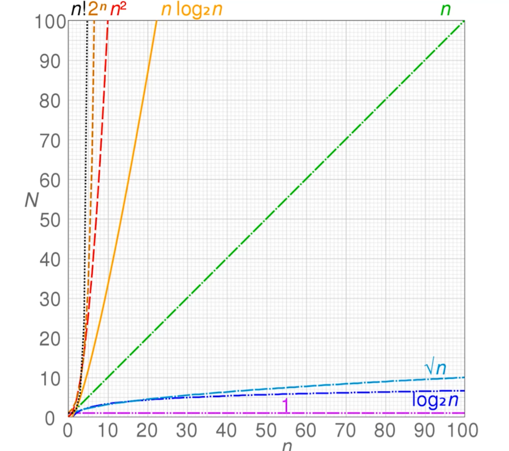

### 时间复杂度



O(1)

```js
let i = 0;
```

O(n)

```js
for (let j = 0; j < n; j += 1) {
  console.log(j);
}
```

O(1)+O(n) -> O(n\*n)

```js
let i = 0;
i += 1;
for (let j = 0; j < n; j += 1) {
  console.log(j);
}
```

O(n)\*O(n) -> O()

```js
for (let i = 0; i < n; i += 1) {
  for (let j = 0; j < n; j += 1) {
    console.log(i, j);
  }
}
```

O(logN)

```js
let i = 1;
while (i < n) {
  console.log(i);
  i *= 2;
}
```

---

### 空间复杂度

算法在运行过程中临时占用存储空间大小的度量
O(1)

```js
let i = 0;
```

O(n)

```js
const list = [];
for (let i = 0; i < n; i += 1) {
  list.push(i);
}
```

O(n\*n) 矩阵

```js
const matrix = [];
for (let i = 0; i < n; i += 1) {
  matrix.push([]);
  for (let j = 0; j < n; j += 1) {
    matrix[i].push(j);
  }
}
```
