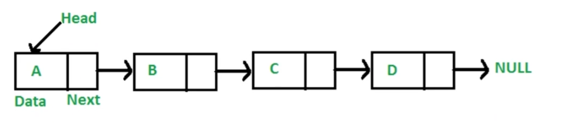

### 基本概念

多个元素组成的列表
元素存储不连续，用 next 指针连在一起
js 中没有链表，可以用 Object 模拟链表

### 数组与链表的区别

数组：增删非首尾元素时往往需要移动元素
链表：增删非首尾元素，不需要移动元素，只需要更改 next 的指向即可
https://leetcode-cn.com/problems/linked-list-cycle/solution/yi-wen-gao-ding-chang-jian-de-lian-biao-wen-ti-h-2/

### 要点

链表的元素存储不是连续的，之间通过 next 连接
js 中没有链表，但可以用 Object 模拟链表
链表的常用操作：修改 next、遍历链表
JS 中的原型链也是一个链表
使用链表指针可以获取 JSON 的节点值
