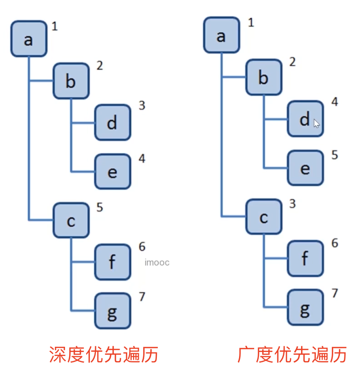
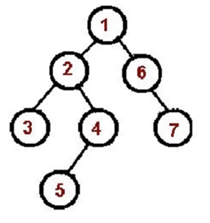
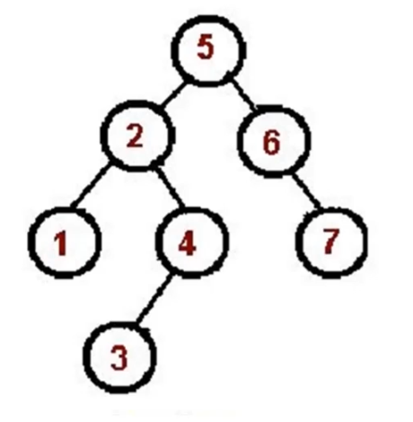
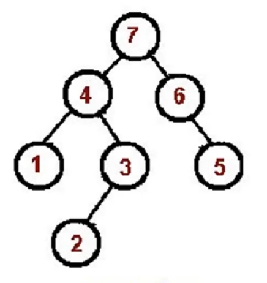

### 基本概念

一种分层数据的抽象模型
前端中常见的树包括：DOM 树、级联选择、树形控件
JS 中没有树，但是可以用 Object 和 Array 来构建树

```js
let tree = {
  value: "hunan",
  label: "hunan",
  children: [
    {
      value: "changsha",
      label: "changsha",
      children: [{ value: "ningxiang", label: "ningxiang" }],
    },
  ],
};
```

树的常用操作：深度/广度优先遍历、先中后序遍历

### 深度/广度优先遍历

深度优先遍历：尽可能深的搜索树的分支

- 访问根节点
- 对根节点的 children 挨个进行深度优先遍历

广度优先遍历：先访问离根节点最近的节点

- 新建一个队列，把根节点入队
- 把队头出队并访问
- 把对头的 children 挨个入队
- 重复第二、三步，直到队列为空



### 二叉树的先中后序遍历

树中每个节点最多只能有两个子节点
在 JS 中通常使用 Object 来模拟二叉树

**先序遍历**

- 访问根节点
- 对根节点的左子树进行先序遍历
- 对根节点的右子树进行先序遍历



**中序遍历**

- 对根节点的左子树进行中序遍历
- 访问根节点
- 对根节点的右子树进行中序遍历



**后序遍历**

- 对根节点的左子树进行后序遍历
- 对根节点的右子树进行后序遍历
- 访问根节点



```js
let binaryTree = {
  value: 1,
  left: {
    value: 2,
    left: null,
    right: null,
  },
  right: {
    value: 3,
    left: null,
    right: null,
  },
};
```
