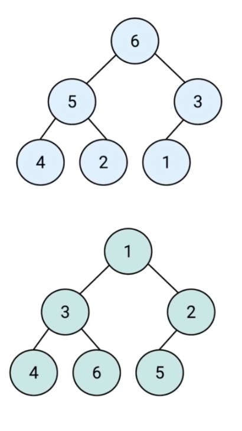
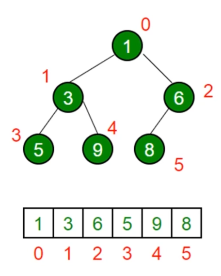

### 基本概念

堆是一种特殊的完全二叉树（每层节点都完全填满，最后一层如果没有被填满，则只缺少右边的若干节点）
所有的节点都大于等于（最大堆）或小于等于（最小堆）它的子节点

JS 中通常用数组表示堆
左侧子节点的位置是 2*index+1
左侧子节点的位置是 2*index+2
父节点的位置(index-1)/2

**堆的应用**
堆能高效、快速的找出最大值和最小值，时间复杂度：O(1)
找出第 k 个最大(小)元素
