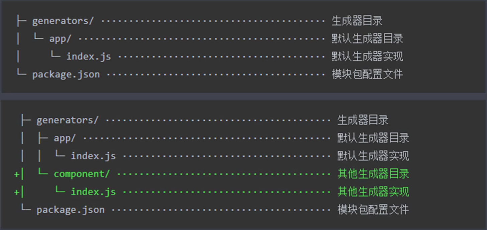
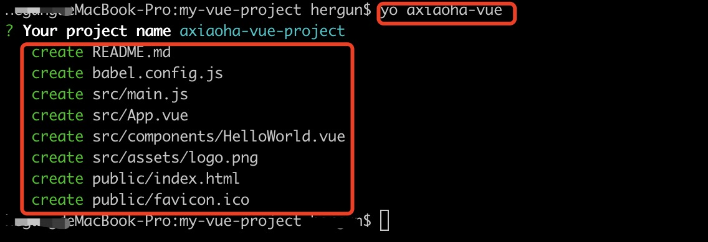

## 工程化概述

### 面临的问题

- 想要使用 ES6+新特性，但是兼容有问题
- 想要使用 less/sass/postcss 增强 css 的编程性，但运行环境不能直接支持
- 想要使用模块化的方式提高项目的可维护性但运行环境不能直接支持
- 部署上线前需要手动压缩代码以及资源文件，部署过程需要手动上传代码到服务器
- 多人协作开发，无法硬性统一大家的代码风格，从仓库中 pull 回来的代码质量无法保证
- 部分功能开发时需要等待后端服务接口提前完成

### 主要解决的问题

- 传统语言或语法的弊端
- 无法使用模块化/组件化
- 重复的机械式工作
- 代码风格统一、质量保证
- 依赖后端服务接口支持
- 整体依赖后端项目

### 工程化的表现

以提高效率、降低成本、质量保证为目的的手段，一切重复的工作都应该被自动化，工程化不等于 webpack 之类的构建工具，工程化的核心在于对项目的整体规划和架构，而工具只是实现这种规划和架构的手段，成熟的工程化集成有 create-react-app、vue-cli 等


- 创建项目：通过脚手架完成项目的基础搭建
- 编码：
  - 格式化代码
  - 校验代码风格
  - 编译/构建/打包
- 预览/测试：
  - web server/mock
  - live reloading/HMR
  - source map
- 提交
  - git hooks
  - lint-staged
  - 持续集成
- 部署

## 脚手架

### 脚手架的本质作用

创建项目基础结构、提供项目规范和约定

**搭建新项目时可能会产生大量的重复工作**

- 相同的组织结构
- 相同的开发范式
- 相同的模块依赖
- 相同的工具配置
- 相同的基础代码

### Yeoman

在全局范围安装 yo

```
npm install -g yo
```

安装对应的 generator(不同的 generator 用于生成不同的项目)

```
npm install -g generator-node
```

通过 yo 运行 generator

```
yo node
```

sub generator(在并不需要创建完整的项目结构时，只需要在已有的项目结构下创建一些特定类型的文件(比如一些配置文件)，但并不是每一个 generator 都有 sub generator)

```
yo generator:xxx
```

```
npm link
```

```
my-module --help
```

常规使用步骤：

1. 明确需求
2. 找到合适的 generator
3. 全局安装 generator
4. 通过 yo 运行对应的 generator
5. 通过命令行交互填写选项
6. 生成所需要的项目结构

#### 自定义 generator

创建 generator 模块，generator 本质上就是一个 npm 模块

**generator 基本结构**



##### 创建以及使用 Generator 模块

1. 创建一个 generator-xxx 的文件夹

2. 在终端进入 generator-xxx 目录，并输入 npm init 和 npm add yeoman-generator

3. 创建 generators/app/index.js 作为 Generator 的核心入口文件

4. 编写入口文件

   ```js
   const Generator = require("yeoman-generator");

   module.exports = class extends Generator {
     writing() {
       // Yeoman自动在生成文件阶段调用此方法
       // 这里尝试往项目目录中写入文件
       // ------------手动创建每一个文件------------
       this.fs.write(
         this.destinationPath("temp.txt"),
         Math.random().toString()
       );
     }
   };
   ```

5. 运行 npm link 将该模块链接到全局范围，使之成为一个全局模块包，让 yeoman 在工作的时候能够找到这个模块

6. 终端进入需要使用该模块的目录，在命令行通过 yo 运行 generator，输入 yo xxx

##### 根据模板创建文件

1. 创建 templates 目录并新建一个模板文件
2. 在 index.js 写入

```js
const Generator = require("yeoman-generator");

module.exports = class extends Generator {
  writing() {
    // 通过模板方式写入文件到目标目录
    // 模板文件路径
    const tmpl = this.templatePath("foo.txt");
    // 输出目标路径
    const output = this.destinationPath("foo.txt");
    // 模板数据上下文
    const context = { title: "hello axiaoha", success: true };
    this.fs.copyTpl(tmpl, output, context);
  }
};
```

相对于手动创建每一个文件，模板的方式大大提高了效率

##### 接收用户输入数据

```js
const Generator = require("yeoman-generator");

module.exports = class extends Generator {
  prompting() {
    // Yeoman在询问用户环节会自动调用此方法
    // 在此方法中可以调用父类的prompt()方法发出对用户的命令行询问
    return this.prompt({
      type: "input",
      name: "name",
      message: "your project name",
      default: this.appname, // appname 为项目生成目录名称
    }).then((answers) => {
      // answers => {name:"user input value"}
      this.answers = answers;
    });
  }
  writing() {
    // ------------接收用户输入数据------------
    // 模板文件路径
    const tmpl = this.templatePath("bar.html");
    // 输出目标路径
    const output = this.destinationPath("bar.html");
    // 模板数据上下文
    const context = this.answers;
    this.fs.copyTpl(tmpl, output, context);
  }
};
```


#### Vue Generator

1. 新建 generator-axiaoha-vue 目录

2. ```js
   npm init
   ```

3. ```js
   npm add yeoman-generator@4.0
   ```

4. 新建入口文件 generators/app/index.js

5. 在 templates 目录里面使用 vue-cli 搭建一个基础的 vue 项目，将使用 vue-cli 生成的文件作为模板文件

6. 将模板文件里面用到了项目名称的地方使用模型语言 EJS

7. 编写 index.js

   ```js
   const Generator = require("yeoman-generator");

   module.exports = class extends Generator {
     prompting() {
       return this.prompt([
         {
           type: "input",
           name: "name",
           message: "Your project name",
           default: this.name,
         },
       ]).then((answers) => {
         this.answers = answers;
       });
     }

     writing() {
       // 把每一个文件都通过模板转换到目标文件
       const templates = [
         "README.md",
         "babel.config.js",
         "src/main.js",
         "src/App.vue",
         "src/components/HelloWorld.vue",
         "src/assets/logo.png",
         "public/index.html",
         "public/favicon.ico",
       ];
       templates.forEach((item) => {
         this.fs.copyTpl(
           this.templatePath(item),
           this.destinationPath(item),
           this.answers
         );
       });
     }
   };
   ```

8. 运行 npm link 将该模块链接到全局范围，使之成为一个全局模块包，让 yeoman 在工作的时候能够找到这个模块

9. 终端进入需要使用该模块的目录，在命令行通过 yo 运行 generator，输入 yo axiaoha-vue

#### 发布 Generator

generator 本质上就是一个 npm 模块，发布 generator 实际就是发布一个 npm 模块

将模块放到 github 仓库之后，执行

```js
npm publish
```

### Plop

一个小而美的脚手架工具，有点类似于 sub-generator，主要用于创建项目中的特定运行的文件的工具，一般用于自动化创建项目中的同类型文件。

1. 使用 vue cli 新建一个 vue 项目 plop-vue-app

2. 将 plop 作为 npm 模块安装到开发依赖当中

   ```json
   npm add plop --dev
   ```

3. 在项目目录下新建一个plopfile.js文件,编写此文件

4. 在package.json文件的scripts里面新增脚本

   ```json
   "scripts": {
      "p": "plop"
    },
   ```

5. 在控制台运行

   ```
   npm run p "生成器名字"
   or
   npm run p // 可以自己选择对应的生成器
   ```

6. 用户数据输入完毕后，在plopfile.js actions配置的路径下会有文件生成（或者其他操作）

**总结**

- 将plop模块作为项目开发依赖安装
- 在项目根目录下创建一个plopfile.js文件
- 在plopfile.js文件中定义脚手架任务
- 编写用于生成特定类型文件的模板
- 通过plop提供的cli运行脚手架任务

vue项目可以参考：https://github.com/PanJiaChen/vue-element-admin.git

### 脚手架工作原理

