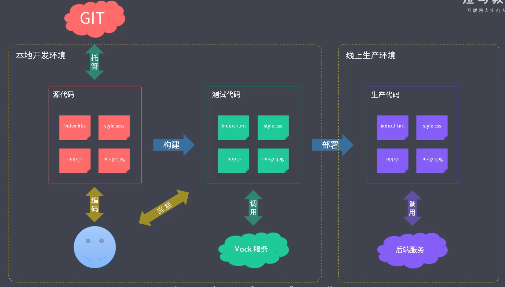

## 工程化概述

#### 面临的问题

- 想要使用ES6+新特性，但是兼容有问题
- 想要使用less/sass/postcss增强css的编程性，但运行环境不能直接支持
- 想要使用模块化的方式提高项目的可维护性但运行环境不能直接支持
- 部署上线前需要手动压缩代码以及资源文件，部署过程需要手动上传代码到服务器
- 多人协作开发，无法硬性统一大家的代码风格，从仓库中pull回来的代码质量无法保证
- 部分功能开发时需要等待后端服务接口提前完成

#### 主要解决的问题

- 传统语言或语法的弊端
- 无法使用模块化/组件化
- 重复的机械式工作
- 代码风格统一、质量保证
- 依赖后端服务接口支持
- 整体依赖后端项目

#### 工程化的表现

以提高效率、降低成本、质量保证为目的的手段，一切重复的工作都应该被自动化，工程化不等于webpack之类的构建工具，工程化的核心在于对项目的整体规划和架构，而工具只是实现这种规划和架构的手段，成熟的工程化集成有create-react-app、vue-cli等



- 创建项目：通过脚手架完成项目的基础搭建
- 编码：
  - 格式化代码
  - 校验代码风格
  - 编译/构建/打包
- 预览/测试：
  - web server/mock
  - live reloading/HMR
  - source map
- 提交
  - git hooks
  - lint-staged
  - 持续集成
- 部署

## 脚手架

#### 脚手架的本质作用

创建项目基础结构、提供项目规范和约定

**搭建新项目时可能会产生大量的重复工作**

- 相同的组织结构
- 相同的开发范式
- 相同的模块依赖
- 相同的工具配置
- 相同的基础代码

#### Yeoman

```
npm install -g yo
```

```
npm install -g generator-node
```

