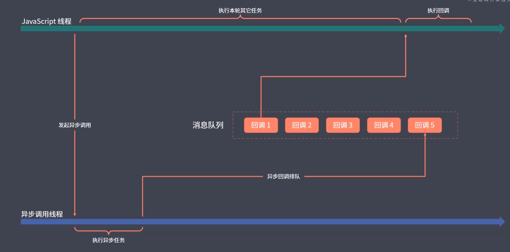

### 概述

js 采用`单线程模式`(js 执行环境中负责执行代码的线程只有一个)工作

**原因**

最早 js 是一门运行在浏览器端的脚本语言，目的是为了实现页面上的动态交互，而实现页面的动态交互的核心在于 dom 操作，如果不使用单线程会出现复杂的线程同步问题，假定在 js 中有多个线程在同时工作，一个线程编辑某个 dom 元素，另一个线程同时删除这个 dom 元素，此时浏览器无法明确以哪一个线程的工作结果为准。

**优点**

安全简单

**缺点**

如果遇到一个特别耗时的任务，后面的任务必须要排队等待这个任务的结束，会导致整个程序的执行会被拖延(阻塞)，出现假死的情况，因此 js 将任务的执行模式分成两种(同步模式、异步模式)

### 同步模式

程序的执行顺序与代码的编写顺序一致，同步不是指同时执行而是指排队执行

### 异步模式

不会去等待这个任务的结束才开始下一个任务，对于耗时任务都是开启过后就立即往后执行下一个任务，后续逻辑一般会通过回调函数的方法定义。在这个过程中会产生的问题是代码的执行顺序混乱。

### Call Stack(调用栈)、Queue(消息队列)、Event Loop(事件循环)、Web APIS

如果说调用栈是正在执行的工作表，那消息队列就可以理解为代办的工作表，js 执行引擎先完成调用栈的所有执行任务，再通过事件循环从消息队列中取一个任务放入调用栈中执行，再次过程中可以往消息队列中放入任务，这些任务会排队等待事件循环。

js 是单线程的，但是浏览器不是单线程，js 调用的某些内部的 api 并不是单线程的(比如 setTimeout)

运行环境提供的 API 是以同步或异步模式的方式工作

### 回调函数

所有异步编程方案的根基
由调用者定义，交给执行者执行的函数

### Promise

直接使用传统回调方式去完成复杂的异步流程，会产生回调地狱的问题

[promise 改写 ajax](https://github.com/axiaoha/FE-STUDY/blob/feature/ES-FULL-VERSION/chapter04-%E5%BC%82%E6%AD%A5%E7%BC%96%E7%A8%8B%E4%B8%8E%E6%A8%A1%E5%9D%97%E5%8C%96/3.%E4%BD%BF%E7%94%A8promise%E6%94%B9%E9%80%A0ajax.js)

Promise 链式调用

相比传统回调函数，Promise 最大的优势是可以进行链式调用，以此来避免回调嵌套
